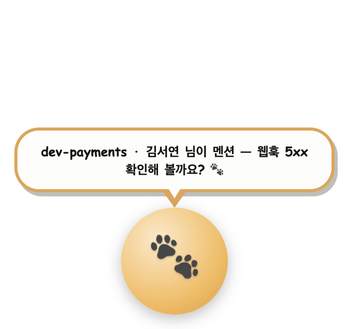
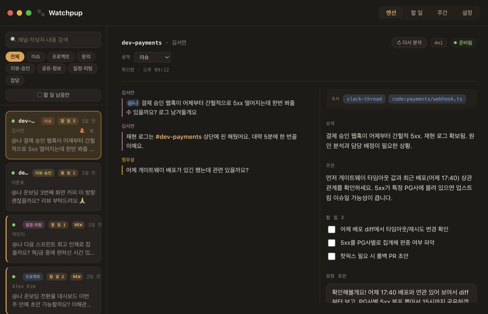

# Watchpup 🐾

<p align="center">
  
</p>

누군가 채널에서 나를 `@멘션`하면, Watchpup이 그 스레드를 로컬 `claude`(Claude Code)로 분석해
**무엇을 해야 하는지**를 말풍선으로 알려준다. 펫을 누르면 요약·할 일·답장 초안이 정리된 패널이 열린다.
**승인 전에는 Slack에 아무것도 쓰지 않으며, 모든 토큰은 Keychain에만** 저장된다.



> 스크린샷은 예시(가상) 데이터. 실제 회사·개인 정보 없음.

## 주요 기능

- **멘션 분석** — 요약 · 조언 · 할 일 · 답장 초안, 스레드 성격 자동 분류, 톤 변형
- **답장 승인** — 초안 확인·수정 후 승인해야만 스레드에 게시(자동 게시 없음)
- **할 일 · 기간별 요약** — 스레드에 흩어진 할 일과 멘션을 모아보기
- **만화책 말풍선 펫** — 대기·분석중·준비됨·대화중 4상태, 드래그, 항상 위 on/off
- **의견 더 구하기** — 같은 스레드로 이어서 스트리밍 상담
- **자가발전** — 만족도·피드백을 워크플로우별 교훈으로 축적해 다음 분석에 반영

## 레이어 구조

Slack 이벤트가 들어온 뒤의 흐름을 레이어로 나눠 설계. 각 레이어는 한 가지 책임만 진다.

```
[감지]         Slack 소켓 · 폴러로 내 멘션 / 스레드 후속을 감지
   ▼
[수집·필터]    중복 제거 + 오래된 메시지 컷오프
   ▼
[보강]         스레드 · 이름 · 채널 · 그룹 정보 해석
   ▼
[분석]         claude -p 로 분석 → 요약 · 조언 · 할 일 · 답장 초안 · 분류
   ▼
[후처리]       소스 태깅 · 자가평가 · Obsidian 노트 · 감사 로그
   ▼
[도메인 이벤트] 펫 상태 · 새 멘션 · 배지 등 이벤트 방출
   ▼
[브리지]       이벤트 → 패널 IPC + 펫 말풍선
   ▼
[표현]         목록 · 상세 · 설정 · 요약 뷰 · 말풍선 렌더
```

사용자 명령(승인 · 워크플로우 실행 · 채팅 · 재분석)은 이 흐름을 역방향으로 탄다.

## 사용법

요구사항 — macOS, Node ≥ 20, 로컬 `claude` CLI 인증, Slack 앱.

### 빠른 실행 (git clone 없이)

```bash
npx github:jaden680/Watchpup
```

최초 실행 시 자동으로 빌드된다. Slack 토큰과 `mySlackUserId`는 패널의 **설정** 탭에서 입력하면 macOS Keychain에 저장된다(`npm run setup` 없이도 가능). 설정·데이터는 실행 위치와 무관하게 `~/.watchpup/`에 저장되므로 어디서 실행해도 같은 상태로 이어진다.

### 저장소에서 실행

```bash
npm install
npm run setup      # Slack 토큰(→Keychain) + mySlackUserId 입력
npm run app        # 데스크톱 앱 실행 (펫 + 패널)
```

**Slack 앱 설정**

1. [api.slack.com/apps](https://api.slack.com/apps) → **From an app manifest** 로 생성 (아래 매니페스트 사용 — 앱 내 **앱 매니페스트 보기**로도 복사 가능)
2. Bot Token(`xoxb-`)·App Token(`xapp-`)을 `npm run setup`에 입력
3. 봇을 대상 채널에 초대 (전 채널 검색 시 User Token `xoxp-` 추가)

```yaml
display_information:
  name: Watchpup
oauth_config:
  scopes:
    user:
      - search:read          # 전 채널 멘션 검색(User Token)
    bot:
      - channels:history
      - groups:history
      - im:history
      - channels:read
      - groups:read
      - chat:write            # 승인한 답장 게시
      - users:read
      - usergroups:read       # 그룹(@subteam) 멘션 해석
settings:
  event_subscriptions:
    bot_events:
      - message.channels
      - message.groups
      - message.im
  socket_mode_enabled: true
```
